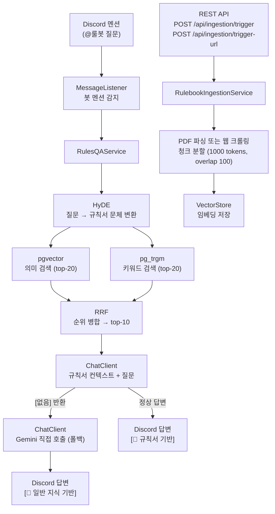

# bb-rules-bot

KBO/MLB 야구 규칙서 기반 RAG Discord Q&A 봇.
규칙서 PDF 및 웹 크롤링 데이터를 벡터 DB에 임베딩하고, HyDE + Hybrid Search(pgvector + pg_trgm + RRF)로 관련 규칙을 검색한 뒤 LLM이 답변합니다.

## 기술 스택

| 역할 | 기술 |
|------|------|
| 언어 / 프레임워크 | Java 21, Spring Boot 3.5 |
| AI | Spring AI, Gemini 2.5 Flash (chat/embedding) |
| 벡터 DB | pgvector + pg_trgm (Neon PostgreSQL) |
| Discord | JDA 5 |
| 빌드 | Gradle |
| 배포 | Docker, GitHub Actions, Oracle Cloud (E2.1.Micro) |

## 아키텍처



**RAG 흐름**
1. 사용자가 Discord에서 봇을 멘션해 야구 규칙 질문
2. HyDE: 구어체 질문을 규칙서 문체(조항·명사형)로 변환 — 존재 여부 판단 없이 주제만 변환
3. Hybrid Search: HyDE 구절로 pgvector 의미 검색 + 원문 질문으로 pg_trgm 키워드 검색
4. RRF(Reciprocal Rank Fusion)로 두 검색 결과를 순위 기반 병합 → top-10 청크 선정
5. 청크를 컨텍스트로 LLM 호출 — 관련 내용 없으면 `[없음]` 반환 후 Gemini 직접 폴백

## 환경변수

```yaml
DB_URL: jdbc:postgresql://<neon-host>/neondb?sslmode=require&currentSchema=bb_rules
DB_USERNAME: <username>
DB_PASSWORD: <password>

AI_API_KEY: <gemini-api-key>
AI_BASE_URL: https://generativelanguage.googleapis.com/v1beta/openai/

DISCORD_BOT_TOKEN: <discord-bot-token>
INGESTION_SECRET: <임의의 시크릿>
```
