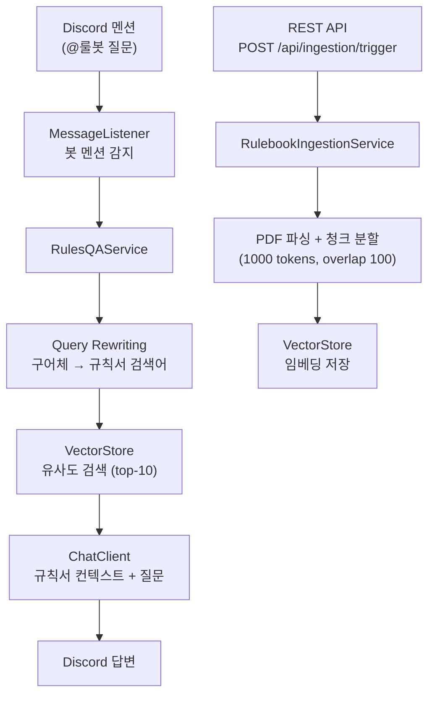

# bb-rules-bot

KBO/MLB 야구 규칙서 기반 RAG Discord Q&A 봇.
규칙서 PDF를 벡터 DB에 임베딩하고, 사용자 질문을 재작성하여 관련 규칙을 검색한 뒤 LLM이 답변합니다.

## 기술 스택

| 역할 | 기술 |
|------|------|
| 언어 / 프레임워크 | Java 21, Spring Boot 3.5 |
| AI | Spring AI, Gemini 2.5 Flash (chat/embedding) |
| 벡터 DB | pgvector (Neon PostgreSQL) |
| Discord | JDA 5 |
| 빌드 | Gradle |

## 아키텍처



**RAG 흐름**
1. 사용자가 Discord에서 봇을 멘션해 야구 규칙 질문
2. 구어체 질문을 규칙서 검색에 적합한 문체로 재작성 (Query Rewriting)
3. 재작성된 쿼리로 pgvector에서 유사 청크 상위 10개 검색
4. 검색된 청크를 컨텍스트로 LLM에 전달해 최종 답변 생성

## 환경변수

```yaml
DB_URL: jdbc:postgresql://<neon-host>/neondb?sslmode=require&currentSchema=bb_rules
DB_USERNAME: <username>
DB_PASSWORD: <password>

AI_API_KEY: <gemini-api-key>
AI_BASE_URL: https://generativelanguage.googleapis.com/v1beta/openai/

DISCORD_BOT_TOKEN: <discord-bot-token>
INGESTION_SECRET: <임의의 시크릿>
```
